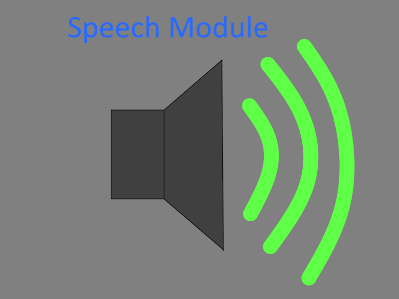

# SpeechModule

This was a collab with someone I studied with. The purpose of this project was to create a wrapper for Microsoft text-to-speech (TTS) synthesizer that was used in combination with a RFID tag reader, which would verbally greet the student as they chipped in through the door. It was featured with possibles to give each user a custom (verbal) message with script symbols. It would otherwise default to their primary language (Norwegian, Swedish, Finnish, Russian and English) that would be determined through a SQL query.

Tags: C#, Speech, TTS, Scripting
